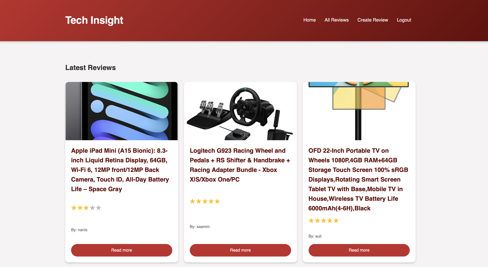
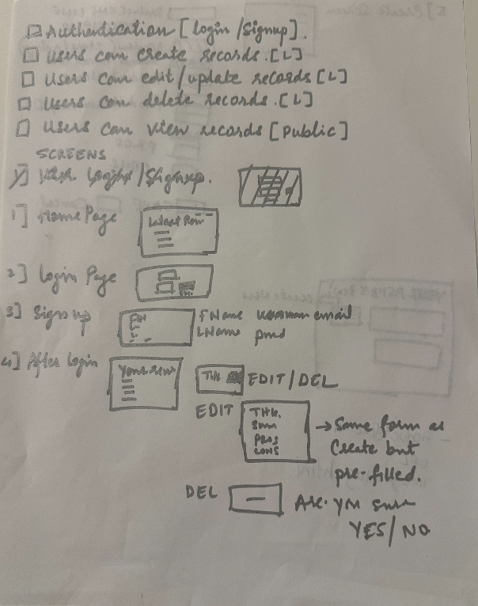
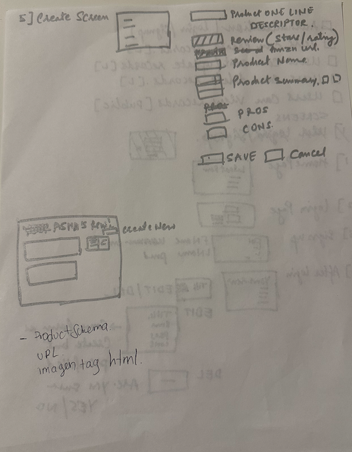
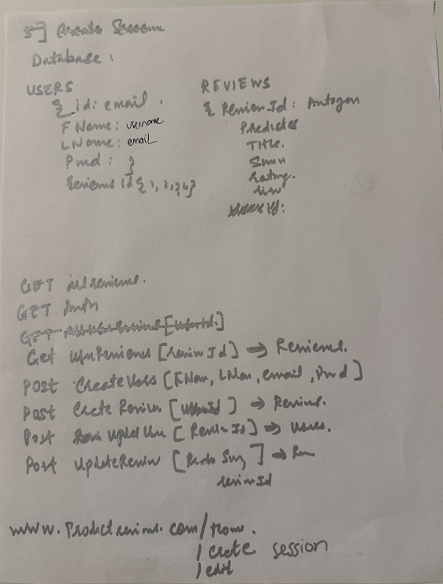

# 💻 Tech Insight

  

**Your trusted community for in-depth tech product reviews and insights**

[🚀 Live Demo](https://review-app-go0h.onrender.com) •  [📂 View Code](https://github.com/ashleymichelle5/review-app)

---

## 📖 About The Project

Tech Insight is a full-stack web application that empowers tech enthusiasts to share and discover comprehensive reviews of electronic products. Built with Node.js and Express, this platform creates a vibrant community where users can make informed purchasing decisions based on real experiences and detailed product evaluations.

### 🎯 Project Vision

In today's fast-paced tech landscape, making informed decisions about electronic purchases can be overwhelming. Tech Insight was created to bridge this gap by providing a platform where users can:

- Share authentic, detailed product reviews
- Rate products with a transparent star-rating system
- Upload images to showcase real-world product usage
- Make confident purchasing decisions

---

## ✨ Key Features

- 📝 **Create Detailed Reviews** - Share comprehensive product evaluations with text and images
- ⭐ **Star Rating System** - Rate products from 1 to 5 stars
- 🖼️ **Image Uploads** - Enhance reviews with product photos
- 🔐 **Secure Authentication** - JWT-based user sessions for data protection
- ✏️ **Edit & Delete** - Full control over your reviews at any time
- 👥 **Community Feedback** - Browse and interact with reviews from other users
- 📱 **Responsive Design** - Seamless experience across all devices
- 🔍 **Personal Dashboard** - Access all your reviews in one place

---

## 🛠️ Built With

### Frontend

### Backend

### Database

### Authentication & Security

### Deployment

---

## 📦 Dependencies & Packages

Tech Insight leverages the following npm packages and libraries:

| Package | Purpose |
|---------|---------|
| `express` | Fast, minimalist web framework for Node.js |
| `mongodb` | Official MongoDB driver for Node.js |
| `jsonwebtoken` | JWT implementation for secure authentication |
| `bcrypt` | Password hashing for secure user credentials |
| `multer` | Middleware for handling multipart/form-data (file uploads) |
| `dotenv` | Environment variable management |
| `cookie-parser` | Parse HTTP request cookies |
| `method-override` | HTTP method override middleware |
| `path` | Node.js path utilities |
| `fs` | File system operations |

### Custom Modules
- `authMiddleware` - Custom authentication middleware for route protection
- `connectDB` - Database connection configuration and management

---

## 📐 Planning & Development

### CRUD Operations

### Views & User Flow

### Models & Routes Architecture

### Project Management
This project was planned and tracked using Trello:

🔗 [View Trello Board](https://trello.com/b/2lMUCF6f/project-2)

---

## 🔐 Security Features

- **Password Hashing**: All passwords are hashed using bcrypt before storage
- **JWT Authentication**: Secure token-based authentication system
- **HTTP-Only Cookies**: Tokens stored in HTTP-only cookies to prevent XSS attacks
- **Environment Variables**: Sensitive data stored securely in `.env` files
- **Input Validation**: Server-side validation to prevent injection attacks
- **Method Override**: Support for RESTful routes with proper HTTP methods

---

## 👨‍💻 Author

**Ashley Sanchez**

- GitHub: [@ashleymichelle5](https://github.com/ashleymichelle5)
- LinkedIn: [Ashley Sanchez](https://www.linkedin.com/in/ashley-sanchez-029331390/)
- Portfolio: [ashleymsanchez.com](https://ashleymsanchez.com)
- Email: ashleymsanchez05@gmail.com

---

