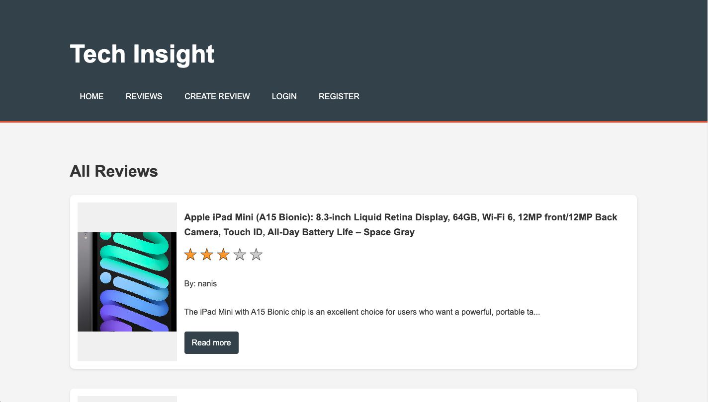

# Tech Insight 

Tech Insight is a dynamic review app tailored for electronics, allowing users to share their experiences with various products. After creating a secure account, users can easily log in to write detailed reviews with star ratings and images. They can edit or delete their reviews anytime and access both their own feedback and insights from the community, fostering an engaging platform for tech enthusiasts.

I created Tech Insight because sharing experiences about electronics is valuable and essential in today’s digital age.

## Planning materials: 

### Links
* [My-Trello](https://trello.com/b/2lMUCF6f/project-2)
* [Deploy-link]()

## Technologies used:

* **Frontend:** HTML, CSS and Javascript.
* **Backend:** Node.js with Express.
* **Database:** MongoDB for storing user data and reviews.
* **Authentication:** JWT (JSON Web Tokens) for secure user sessions.

#### The code uses the following libraries: 
* **dotenv**
* **express** 
* **path**
* **cookie-parser**
* **method-override**
* **authMiddleware** 
* **connectDB** (custom module, not a library) for connecting to the databse
* **fs**
* **jsonwebtoken**
* **bcrypt**
* **multer**
